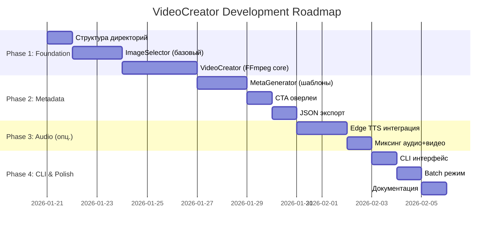

# 🎬 VideoCreator: Роадмап разработки скрипта создания видео из картинок

> **Цель:** Разработать Python-модуль для автоматического создания TikTok-ready слайд-шоу из картинок с генерацией метаданных (описания, CTA, хештеги) и опциональной синтетической речью.

---

## Обзор контекста

Согласно документу [TikTok → Dating.md](file:///Users/onetiger/projects/QuickTok/docs/TikTok%20%E2%86%92%20Dating.md):
- **Формат:** Слайд-шоу — основной формат для POC
- **Разрешение:** 1080x1920 (9:16)
- **Длительность:** 7-15 секунд (оптимально 10-12 сек)
- **Смена кадра:** каждые 2-3 секунды
- **Количество фото:** 3-5 штук на ролик
- **Структура:** Hook (0-2 сек) → Контент (2-10 сек) → CTA (10-12 сек)

---

## ✅ Принятые решения

> [!NOTE]
> **Архитектурные решения согласованы:**

### 1. Структура хранения картинок ✅

Одобрена следующая структура `data/` с учетом сетов по моделям:

```
QuickTok/
├── data/
│   ├── incoming.json/         # Уже есть - JSON с видео
│   ├── photos/                # [NEW] Пул картинок для слайд-шоу
│   │   ├── pool/              # Исходные сеты (по моделям/темам)
│   │   │   ├── ModelName_Set01/
│   │   │   │   ├── raw_01.jpg
│   │   │   │   └── raw_02.jpg
│   │   │   └── ModelName_Set02/
│   │   ├── sets/              # [Staging] Готовые отобранные наборы для видео
│   │   │   └── 2026-01-20_ModelName_Set01/  # Date + SourceSetName
│   │   │       ├── 01.jpg
│   │   │       ├── 02.jpg
│   │   │       └── 03.jpg
│   │   └── used/              # Использованные/Архив
│   ├── output/                # [NEW] Готовые видео + мета
│   │   └── YYYY-MM-DD/
│   │       ├── 2026-01-20_ModelName_Set01.mp4  # Correlated Filename
│   │       ├── 2026-01-20_ModelName_Set01.json
│   │       └── ...
│   └── temp/                  # Уже есть - временные файлы
```

---

### 2. Механизм выбора картинок ✅

**Workflow:**
1.  **Source:** Берём исходную папку из `pool/` (например, `ModelA_Set1`).
2.  **Select & Stage:** Выбираем лучшие/случайные 3-5 фото.
3.  **Move:** Перемещаем их в папку `sets/YYYY-MM-DD_ModelA_Set1/`.
4.  **Create:** Генерируем видео из папки в `sets/`.
5.  **Output:** Имя видео соответствует имени папки сета.

| Уровень | Описание | Статус |
|---------|----------|--------|
| **A) Model Sets** | Работа с папками моделей из `pool/` | ✅ MVP |
| **B) Auto-Staging** | Авто-создание папки в `sets/` с датой | ✅ MVP |


---

### 3. Синтетическая речь (TTS) ⏳

**Решение:** Отложено на следующую итерацию. MVP без TTS — музыка добавляется при заливе.

---

### 4. Генерация текстов ✅

**Решение:** Шаблоны с ротацией. LLM не используем на первом этапе.

---

### 5. Ken Burns эффект ✅

**Решение:** Добавляем, если реализация быстрая (простой zoom через FFmpeg).

---

### 6. Водяные знаки ✅

**Решение:** Не обрабатываем. Считаем, что входные картинки чистые.

---

## Proposed Changes

### Компонент 1: Core Video Creator

#### [NEW] [video_creator.py](file:///Users/onetiger/projects/QuickTok/src/video_creator.py)

Основной модуль создания видео:

```python
# Планируемый интерфейс
class VideoCreator:
    def __init__(self, config: VideoConfig):
        self.config = config
        
    def create_slideshow(
        self, 
        images: List[Path],
        output_path: Path,
        audio_path: Optional[Path] = None
    ) -> VideoResult:
        """Создаёт слайд-шоу из списка изображений"""
        
    def add_cta_overlay(
        self, 
        video_path: Path,
        cta_text: str,
        position: str = "bottom"
    ) -> Path:
        """Добавляет текстовый CTA оверлей"""
```

**Ключевые функции:**
- Подготовка изображений (resize, crop, Ken Burns эффект)
- Создание слайд-шоу через FFmpeg
- Добавление переходов между кадрами
- Наложение CTA текста
- Очистка метаданных

---

#### [NEW] [image_selector.py](file:///Users/onetiger/projects/QuickTok/src/image_selector.py)

Модуль выбора и подготовки картинок:

```python
class ImageSelector:
    def __init__(self, data_dir: Path):
        self.pool_dir = data_dir / "photos/pool"
        self.sets_dir = data_dir / "photos/sets"
        self.used_dir = data_dir / "photos/used"
        
    def list_pool_sets(self) -> List[str]:
        """Возвращает список доступных сетов в pool"""
        pass

    def create_staging_set(self, source_set_name: str, count: int = 4) -> str:
        """
        1. Выбирает count картинок из pool/source_set_name
        2. Создает папку sets/YYYY-MM-DD_source_set_name
        3. Перемещает картинки туда
        Returns: имя созданного staging сета
        """
        pass
        
    def get_staging_images(self, staging_set_name: str) -> List[Path]:
        """Возвращает пути к картинкам в staging сете"""
        pass
```

**Ключевые функции:**
- Работа с папками моделей
- Перемещение файлов (Move workflow)
- Создание именованных сетов с датой


---

### Компонент 2: Metadata Generator

#### [NEW] [meta_generator.py](file:///Users/onetiger/projects/QuickTok/src/meta_generator.py)

Генерация метаданных для TikTok:

```python
@dataclass
class VideoMeta:
    title: str              # Краткое название
    description: str        # Текст описания с CTA
    hashtags: List[str]     # Хештеги (#fyp, #dating, etc.)
    cta_text: str           # Текст для оверлея на видео
    tts_script: Optional[str]  # Текст для озвучки (если нужен)

class MetaGenerator:
    def generate(self, style: str = "dating_es") -> VideoMeta:
        """Генерирует метаданные для видео"""
```

**Шаблоны CTA (испанский):**
```
- "Link en bio 🔥"
- "Más en mi perfil 👆"  
- "¿Quieres ver más? 😏"
- "Sígueme para más 💕"
```

**Хештеги:**
```
#fyp #parati #dating #spain #viral #love #single
```

---

### Компонент 3: Audio Module (опционально)

#### [NEW] [audio_generator.py](file:///Users/onetiger/projects/QuickTok/src/audio_generator.py)

Генерация синтетической речи:

```python
class AudioGenerator:
    def generate_tts(
        self, 
        text: str, 
        voice: str = "es-ES-ElviraNeural",
        output_path: Path
    ) -> Path:
        """Генерирует аудио из текста через Edge TTS"""
```

**Примеры скриптов для озвучки:**
```
"¿Buscas a alguien especial? Mira mi perfil..."
"Me encanta conocer gente newline nueva. ¿Y tú?"
"Hola, soy María. ¿Hablamos?"
```

---

### Компонент 4: CLI и интеграция

#### [MODIFY] main entry point

Добавить CLI команды:

```bash
# Создать видео из случайных картинок
python -m quicktok.video create --random 4

# Создать видео из готового набора
python -m quicktok.video create --set "2026-01-20_001"

# Создать видео с TTS
python -m quicktok.video create --random 4 --tts

# Batch создание (N видео)
python -m quicktok.video batch --count 5
```

---

## Выходные данные

Каждое созданное видео будет сопровождаться JSON с метаданными:

```json
{
  "id": "2026-01-20_001",
  "created_at": "2026-01-20T16:30:00Z",
  "video_path": "output/2026-01-20/video_001.mp4",
  "source_images": [
    "photos/pool/img_001.jpg",
    "photos/pool/img_002.jpg",
    "photos/pool/img_003.jpg"
  ],
  "meta": {
    "description": "😏 She's waiting for you...\n.\n.\n.\n",
    "hashtags": ["#fyp", "#dating", "#spain", "#viral"],
    "cta_text": "Link en bio 🔥"
  },
  "audio": {
    "type": "none | tts | music",
    "tts_text": "¿Buscas a alguien especial?"
  },
  "specs": {
    "resolution": "1080x1920",
    "duration_sec": 12,
    "fps": 30,
    "codec": "h264"
  }
}
```

---

## Verification Plan

### Automated Tests

```bash
# Unit тесты для image_selector
pytest tests/test_image_selector.py -v

# Integration тест создания видео
pytest tests/test_video_creator.py -v

# Проверка выходного видео через ffprobe
ffprobe -v error -show_format -show_streams output/test.mp4
```

### Manual Verification

1. **Визуальная проверка:** Открыть созданное видео, проверить:
   - Корректное разрешение (1080x1920)
   - Плавные переходы между кадрами
   - Читаемость CTA текста
   - Длительность 7-15 секунд

2. **Метаданные:** Проверить JSON файл рядом с видео

3. **TikTok совместимость:** Имитировать загрузку через draft

---

## Этапы разработки (Roadmap)



### Фаза 1: Foundation (5-6 дней)
- [ ] Создать структуру директорий для картинок
- [ ] Реализовать `ImageSelector` — выбор и валидация картинок
- [ ] Реализовать `VideoCreator` — базовое FFmpeg слайд-шоу
- [ ] Добавить Ken Burns эффект (zoom/pan на статичных фото)
- [ ] Тесты для базового функционала

### Фаза 2: Metadata (3-4 дня)
- [ ] Реализовать `MetaGenerator` с шаблонами CTA/хештегов
- [ ] Добавить наложение CTA текста на видео
- [ ] Генерация JSON с метаданными
- [ ] Опционально: интеграция с LLM для разнообразия текстов

### Фаза 3: Audio (опционально, 3 дня)
- [ ] Интеграция Edge TTS для испанских голосов
- [ ] Генерация скриптов для озвучки
- [ ] Миксинг аудио дорожки с видео

### Фаза 4: CLI & Polish (2-3 дня)
- [ ] CLI интерфейс с командами
- [ ] Batch режим для создания нескольких видео
- [ ] Документация и примеры использования

---

## Зависимости

```
# requirements.txt (дополнения)
ffmpeg-python>=0.2.0    # Python обёртка над FFmpeg
Pillow>=10.0.0          # Работа с изображениями
edge-tts>=6.1.0         # Синтетическая речь (опционально)
langchain-groq>=0.1.0   # LLM генерация текстов (опционально)
```

**Системные требования:**
- FFmpeg установлен (`brew install ffmpeg`)
- ImageMagick (опционально, для расширенной обработки)

---

## ✅ Статус плана

**План согласован.** Все архитектурные решения приняты:

| Решение | Статус |
|---------|--------|
| Структура `data/photos/` | ✅ Одобрено |
| Выбор картинок (ручной + рандом) | ✅ MVP |
| TTS | ⏳ Отложено |
| Генерация текстов | ✅ Шаблоны |
| Ken Burns эффект | ✅ Если быстро |
| Водяные знаки | ✅ Не нужно |

**Готов к началу реализации.**
