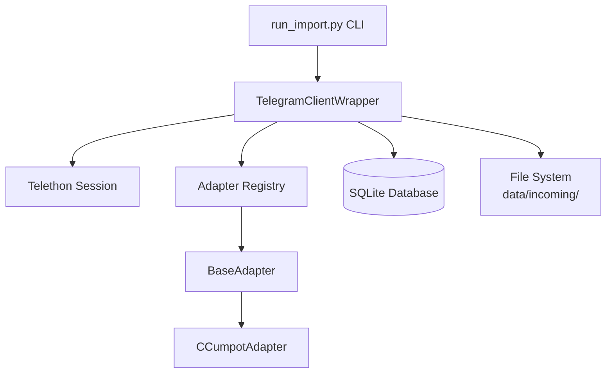

# Design: Telegram Content Import Module

## Architecture Overview



## Components

### 1. TelegramClientWrapper (`src/telegram/client.py`)

Отвечает за:
- Подключение к Telegram через Telethon с использованием session-файла.
- Итерацию по истории канала (пагинация).
- Скачивание медиа-файлов.
- Координацию с Adapter и Database.

```python
class TelegramClientWrapper:
    def __init__(self, session_path: Path, api_id: int, api_hash: str):
        ...
    
    async def connect(self) -> None:
        """Подключение к Telegram."""
        
    async def import_channel(
        self, 
        channel_name: str, 
        adapter: BaseAdapter,
        limit: int | None = None
    ) -> ImportResult:
        """
        Основной метод импорта.
        - Итерирует по постам от новых к старым.
        - Для каждого поста вызывает adapter.filter() и adapter.extract_metadata().
        - Проверяет дубликаты через database.
        - Если дубликат — пропускает и продолжает (не считается в limit).
        - Скачивает медиа из поста и комментариев, если пост новый.
        - Сохраняет запись в БД.
        - Параметр limit указывает количество СКАЧАННЫХ новых постов, а не общее количество проверенных.
        """
        
    async def download_media_with_comments(self, message: Message, dest_folder: Path, channel_entity) -> list[Path]:
        """
        Скачивает все медиа из сообщения и его комментариев в указанную папку.
        - Скачивает медиа из основного поста.
        - Итерирует по комментариям (reply_to=message.id).
        - Скачивает медиа из каждого комментария.
        - Возвращает общий список всех скачанных файлов.
        """
```

**Логика обработки ошибок:**
- При ошибке скачивания: логируем, инкрементим счётчик, пропускаем пост.
- При 3 ошибках подряд: прерываем импорт, возвращаем частичный результат.
- Успешное скачивание сбрасывает счётчик ошибок.

---

### 2. BaseAdapter (`src/telegram/adapters/base.py`)

Абстрактный класс для нормализации данных из разных каналов.

```python
from abc import ABC, abstractmethod
from telethon.tl.types import Message

class BaseAdapter(ABC):
    @property
    @abstractmethod
    def channel_name(self) -> str:
        """Имя канала, который обрабатывает этот адаптер."""
    
    @abstractmethod
    def filter(self, message: Message) -> bool:
        """
        Возвращает True, если пост нужно скачивать.
        Используется для фильтрации рекламы, служебных постов и т.д.
        """
    
    @abstractmethod
    def extract_metadata(self, message: Message) -> NormalizedMetadata:
        """
        Извлекает структурированные метаданные из сообщения.
        Возвращает NormalizedMetadata с model_name, set_name и т.д.
        """
```

---

### 3. CCumpotAdapter (`src/telegram/adapters/ccumpot.py`)

Конкретная реализация для канала CCumpot.

**Формат caption:**
```
Контент модели🦄
💕{ModelName}💕
{SetDescription}🔥
```

**Логика парсинга:**
1. Берём вторую строку caption (первая обычно "Контент модели🦄").
2. Удаляем все emoji из строки — остаётся `model_name`.
3. Если второй строки нет или она пустая после очистки — `model_name = "Unknown"`.
4. Третья строка (если есть) — `set_name` (опционально, также без emoji).

```python
import re

# Regex для удаления emoji
EMOJI_PATTERN = re.compile(
    "["
    "\U0001F600-\U0001F64F"  # emoticons
    "\U0001F300-\U0001F5FF"  # symbols & pictographs
    "\U0001F680-\U0001F6FF"  # transport & map
    "\U0001F1E0-\U0001F1FF"  # flags
    "\U00002702-\U000027B0"
    "\U000024C2-\U0001F251"
    "]+",
    flags=re.UNICODE
)

class CCumpotAdapter(BaseAdapter):
    @property
    def channel_name(self) -> str:
        return "CCumpot"
    
    def filter(self, message: Message) -> bool:
        # Фильтрация отключена — принимаем все посты с медиа
        return message.media is not None
    
    def extract_metadata(self, message: Message) -> NormalizedMetadata:
        text = message.text or message.message or ""
        model_name = self._parse_model_name(text)
        set_name = self._parse_set_name(text)
        content_format = self._detect_format(message)
        return NormalizedMetadata(
            model_name=model_name,
            set_name=set_name,
            content_format=content_format
        )
    
    def _strip_emoji(self, text: str) -> str:
        """Удаляет все emoji из строки."""
        return EMOJI_PATTERN.sub('', text).strip()
    
    def _parse_model_name(self, text: str) -> str:
        """Извлекает имя модели из второй строки, очищая от emoji."""
        lines = text.strip().split('\n')
        if len(lines) < 2:
            return "Unknown"
        second_line = self._strip_emoji(lines[1])
        return second_line if second_line else "Unknown"
    
    def _parse_set_name(self, text: str) -> str | None:
        """Извлекает название сета из третьей строки, очищая от emoji."""
        lines = text.strip().split('\n')
        if len(lines) < 3:
            return None
        third_line = self._strip_emoji(lines[2])
        return third_line if third_line else None
```

---

### 4. Data Models (`src/telegram/models.py`)

```python
from pydantic import BaseModel
from datetime import datetime
from enum import Enum

class ContentFormat(str, Enum):
    PHOTO = "photo"
    VIDEO = "video"
    MIXED = "mixed"

class NormalizedMetadata(BaseModel):
    """Выход адаптера — нормализованные метаданные."""
    model_name: str
    set_name: str | None = None
    content_format: ContentFormat

class ImportedPost(BaseModel):
    """Запись в БД об импортированном посте."""
    id: int | None = None  # SQLite autoincrement
    channel_name: str
    post_id: int  # ID сообщения в канале
    date: datetime
    model_name: str
    set_name: str | None = None
    content_format: ContentFormat
    file_path: str  # Относительный путь к папке с контентом

class ImportResult(BaseModel):
    """Результат импорта."""
    total_processed: int
    downloaded: int
    skipped_duplicates: int
    errors: int
    stopped_early: bool = False  # True если прервано из-за 3 ошибок
```

---

### 5. Database Repository (`src/telegram/database.py`)

```python
class TelegramImportDB:
    def __init__(self, db_path: Path):
        """Инициализация SQLite, создание таблицы если не существует."""
    
    def post_exists(self, channel_name: str, post_id: int) -> bool:
        """Проверка дубликата по channel_name + post_id."""
    
    def save_post(self, post: ImportedPost) -> int:
        """Сохранение поста, возвращает id."""
    
    def get_posts_by_channel(self, channel_name: str) -> list[ImportedPost]:
        """Получение всех постов канала (для отладки)."""
```

**Схема таблицы:**
```sql
CREATE TABLE IF NOT EXISTS imported_posts (
    id INTEGER PRIMARY KEY AUTOINCREMENT,
    channel_name TEXT NOT NULL,
    post_id INTEGER NOT NULL,
    date TIMESTAMP NOT NULL,
    model_name TEXT NOT NULL,
    set_name TEXT,
    content_format TEXT NOT NULL,
    file_path TEXT NOT NULL,
    created_at TIMESTAMP DEFAULT CURRENT_TIMESTAMP,
    UNIQUE(channel_name, post_id)
);
```

---

### 6. File Storage

**Структура:**
```
data/incoming/
  └── {channel_name}/
      └── {YYYY-MM-DD_HH-mm-ss}/
            ├── file1.jpg
            ├── file2.mp4
            └── ...
```

- Папка создаётся для каждого поста.
- Имя папки: timestamp поста.
- Имена файлов: оригинальные (как в Telegram).

---

### 7. CLI Entrypoint (`run_import.py`)

```python
import asyncio
import argparse
from src.telegram.client import TelegramClientWrapper
from src.telegram.adapters.ccumpot import CCumpotAdapter

def main():
    parser = argparse.ArgumentParser(description="Import content from Telegram channels")
    parser.add_argument("--channel", required=True, help="Channel name (e.g., CCumpot)")
    parser.add_argument("--limit", type=int, default=None, help="Max posts to process")
    args = parser.parse_args()
    
    # Выбор адаптера по имени канала
    adapters = {
        "ccumpot": CCumpotAdapter(),
    }
    adapter = adapters.get(args.channel.lower())
    if not adapter:
        print(f"Unknown channel: {args.channel}")
        return
    
    # Запуск импорта
    asyncio.run(run_import(adapter, args.limit))

async def run_import(adapter, limit):
    ...
```

---

## Error Handling Strategy

| Ситуация | Действие |
|----------|----------|
| Ошибка подключения | Логируем, завершаем с ошибкой |
| Пост уже в БД | Пропускаем (skipped_duplicates++) |
| Ошибка скачивания файла | Логируем, errors++, продолжаем |
| 3 ошибки подряд | Логируем, stopped_early=True, возвращаем результат |
| Пост без медиа | adapter.filter() → False, пропускаем |

---

## Configuration

Из `.env`:
```
TELEGRAM_API_ID=...
TELEGRAM_API_HASH=...
```

Из кода (constants):
```python
SESSIONS_DIR = Path("data/sessions")
INCOMING_DIR = Path("data/incoming")
DATABASE_PATH = Path("data/telegram_imports.db")
MAX_CONSECUTIVE_ERRORS = 3
```
