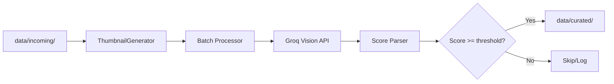

# Proposal: LLM Curation Pipeline

## Summary
Реализация модуля LLM-курации для оценки и фильтрации импортированных изображений из `data/incoming/`. Модуль создаёт оптимизированные thumbnails, отправляет их в LLM для оценки "вирусного потенциала", и перемещает лучшие изображения в `data/curated/`.

## Problem Statement
После импорта контента из Telegram в `data/incoming/` остаётся большое количество картинок разного качества. Вручную отбирать лучшие — долго и субъективно. Нужен автоматизированный LLM-powered пайплайн для:

1. **Фильтрации NSFW/explicit контента** — автоматическое отсеивание неподходящего
2. **Оценки engagement-потенциала** — какие картинки "зацепят" TikTok-аудиторию
3. **Ранжирования** — сортировка по привлекательности для финального отбора

## Goals
- Создать thumbnail-оптимизатор для эффективной отправки в LLM (min tokens, max quality)
- Разработать scoring-систему для оценки изображений
- Автоматически фильтровать explicit контент
- Переносить top-N изображений в `data/curated/` для VideoCreator

## Non-Goals
- Не генерируем контент (только оцениваем)
- Не создаём видео на этом этапе
- Не храним историю оценок (MVP — stateless)

## Proposed Solution

### Workflow



### CLI Interface

```bash
# Оценить все изображения в папке
python -m src.curation curate data/incoming/CCumpot/2026-01-22_07-01-58/

# Оценить с кастомным threshold
python -m src.curation curate data/incoming/CCumpot/ --threshold 7

# Dry-run (только показать оценки, не перемещать)
python -m src.curation curate data/incoming/CCumpot/ --dry-run

# Обработать весь incoming
python -m src.curation curate-all --threshold 7
```

## User Review Required

> [!IMPORTANT]
> **Выбор LLM API**: Groq поддерживает vision-модели (llama-3.2-90b-vision-preview). Подтвердите использование Groq или предпочтителен OpenAI GPT-4V?

>>Подтверждаю. 

> [!WARNING]
> **Критерии оценки**: Предлагаю следующие критерии для scoring. Нужна валидация:
> 1. **Wow-factor (1-10)** — визуальная привлекательность
> 2. **Engagement potential (1-10)** — поза, выражение, энергетика
> 3. **TikTok-fit (1-10)** — соответствие формату/вайбу платформы
> 4. **Is Explicit (boolean)** — explicit = reject

>>Подтверждаю. 

> [!CAUTION]
> **Thumbnail quality**: Планирую резать до 512x512 и JPEG quality 60%. Это может потерять детали. Размер ~30-50KB на картинку. Нужно балансировать между токен-эффективностью и качеством оценки.

>>Подтверждаю. 

## Implementation Phases

### Phase 1: Thumbnail Generator
- Создание thumbnails (resize, compress)
- Base64 encoding для API

### Phase 2: LLM Scoring
- Prompt engineering для vision-модели
- Парсинг structured output (JSON)
- Explicit content detection

### Phase 3: Curation Logic
- Threshold-based filtering
- Moving files to `data/curated/`
- Reporting/logging

### Phase 4: CLI & Integration
- CLI commands
- Integration tests
- Documentation

## Dependencies
- `Pillow` — image processing
- `langchain-groq` или `openai` — LLM API
- Existing: `pydantic`, `typer`

## Success Criteria
1. Thumbnails ≤ 50KB, quality достаточна для LLM-оценки
2. LLM корректно идентифицирует explicit контент (0 false negatives)
3. Top-scored изображения субъективно лучше low-scored
4. Pipeline обрабатывает 100 картинок за < 5 минут

## Related Specs
- `telegram-client` — источник данных в `data/incoming/`
- `project.md` → LLM Curation workflow

## Decisions

1. **Threshold**: 7.0 (Confirmed).
2. **Batching**: Enabled (Multiple images per API request).
3. **Directory Structure**: Maintain `data/incoming/` hierarchy in `data/curated/`.
4. **Error Handling**: Stop curation process after 3 consecutive API errors (Circuit Breaker).
