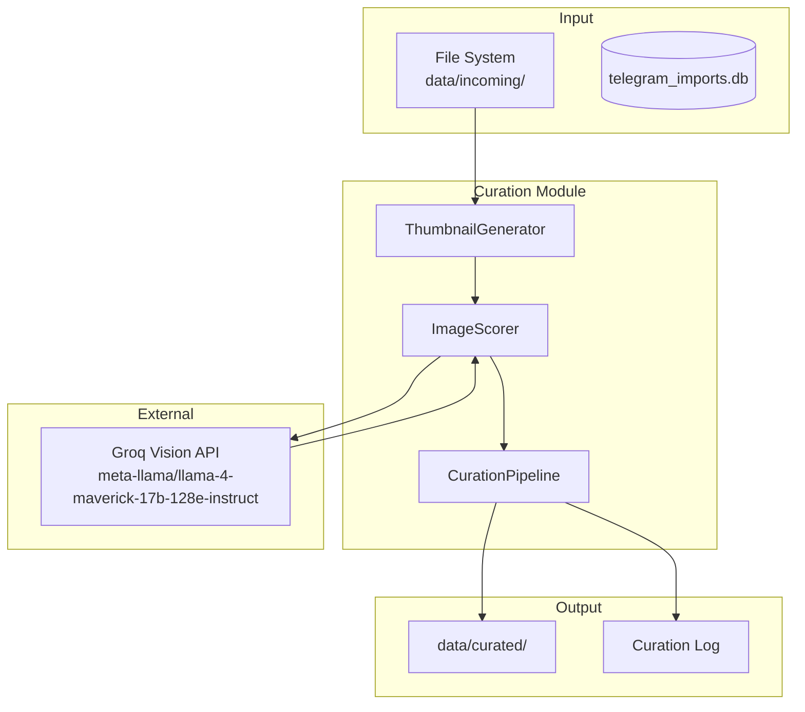

# Design: LLM Curation Pipeline

## Architecture Overview



## Components

### 1. ThumbnailGenerator (`src/curation/thumbnail.py`)

Оптимизирует изображения для отправки в LLM.

```python
from pathlib import Path
from PIL import Image
import base64
import io

class ThumbnailGenerator:
    def __init__(
        self, 
        max_size: tuple[int, int] = (512, 512),
        quality: int = 60,
        format: str = "JPEG"
    ):
        self.max_size = max_size
        self.quality = quality
        self.format = format
    
    def generate(self, image_path: Path) -> bytes:
        """
        Создаёт оптимизированный thumbnail.
        - Resize с сохранением aspect ratio
        - Compress до заданного quality
        - Возвращает bytes для base64 encoding
        """
        with Image.open(image_path) as img:
            # Convert to RGB if needed (for JPEG)
            if img.mode in ("RGBA", "P"):
                img = img.convert("RGB")
            
            # Resize maintaining aspect ratio
            img.thumbnail(self.max_size, Image.Resampling.LANCZOS)
            
            # Compress to bytes
            buffer = io.BytesIO()
            img.save(buffer, format=self.format, quality=self.quality, optimize=True)
            return buffer.getvalue()
    
    def to_base64(self, image_path: Path) -> str:
        """Возвращает base64-encoded строку для API."""
        thumbnail_bytes = self.generate(image_path)
        return base64.b64encode(thumbnail_bytes).decode("utf-8")
    
    def estimate_tokens(self, image_path: Path) -> int:
        """
        Оценка количества токенов для изображения.
        Примерная формула: (width * height) / 750 для vision моделей.
        """
        thumbnail = self.generate(image_path)
        with Image.open(io.BytesIO(thumbnail)) as img:
            return (img.width * img.height) // 750
```

**Оптимизация размера:**

| Resolution | File Size | Est. Tokens | Notes |
|------------|-----------|-------------|-------|
| 256x256    | ~15KB     | ~87         | Слишком мало деталей |
| 512x512    | ~40KB     | ~350        | ✅ Оптимальный баланс |
| 768x768    | ~80KB     | ~787        | Дороже, но точнее |
| 1024x1024  | ~150KB    | ~1398       | Избыточно |

---

### 2. ImageScorer (`src/curation/scorer.py`)

Отправляет изображения в LLM и парсит ответ.

```python
from pydantic import BaseModel
from langchain_groq import ChatGroq
from langchain_core.messages import HumanMessage

class ImageScore(BaseModel):
    """Структурированный ответ от LLM."""
    wow_factor: int          # 1-10: визуальная привлекательность
    engagement: int          # 1-10: потенциал вовлечения
    tiktok_fit: int          # 1-10: соответствие TikTok
    is_explicit: bool        # True = reject
    reasoning: str           # Краткое объяснение
    
    @property
    def combined_score(self) -> float:
        """Средний балл (если не explicit)."""
        if self.is_explicit:
            return 0.0
        return (self.wow_factor + self.engagement + self.tiktok_fit) / 3

class ImageScorer:
    def __init__(self, model: str = "meta-llama/llama-4-maverick-17b-128e-instruct"):
        self.llm = ChatGroq(model=model, temperature=0)
        self.thumbnail_gen = ThumbnailGenerator()
    
    async def score(self, image_path: Path) -> ImageScore:
        """Оценивает одно изображение."""
        base64_image = self.thumbnail_gen.to_base64(image_path)
        
        message = HumanMessage(
            content=[
                {"type": "text", "text": self._get_prompt()},
                {
                    "type": "image_url",
                    "image_url": {"url": f"data:image/jpeg;base64,{base64_image}"}
                }
            ]
        )
        
        response = await self.llm.ainvoke([message])
        return self._parse_response(response.content)
    
    async def score_batch(self, image_paths: list[Path]) -> list[ImageScore]:
        """Оценивает несколько изображений (один запрос)."""
        # Implementation for batch scoring
        ...
    
    def _get_prompt(self) -> str:
        return SCORING_PROMPT
    
    def _parse_response(self, content: str) -> ImageScore:
        """Парсит JSON из ответа LLM."""
        # Extract JSON from response
        ...
```

---

### 3. Scoring Prompt

```python
SCORING_PROMPT = """You are an expert TikTok content curator evaluating images for a slideshow video.

Analyze this image and provide a JSON response with the following structure:

{
  "wow_factor": <1-10>,
  "engagement": <1-10>,
  "tiktok_fit": <1-10>,
  "is_explicit": <true/false>,
  "reasoning": "<brief explanation>"
}

**Scoring Criteria:**

**wow_factor** (1-10): Visual appeal and first-impression impact
- 10: Stunning, magazine-quality, instantly captivating
- 7-9: Very attractive, professional quality
- 4-6: Average, nothing special
- 1-3: Poor quality, unflattering, blurry

**engagement** (1-10): Potential to make viewers stop scrolling
- 10: Can't look away, creates curiosity
- 7-9: Eye-catching pose, expression, or styling
- 4-6: Standard photo, won't stop a scroll
- 1-3: Boring, generic, easily forgettable

**tiktok_fit** (1-10): Suitability for TikTok dating/lifestyle content
- 10: Perfect for TikTok vibes, trendy aesthetic
- 7-9: Good fit, appropriate style
- 4-6: Neutral, could work
- 1-3: Doesn't fit TikTok culture/aesthetic

**is_explicit** (boolean): Set to TRUE if the image contains:
- Nudity or exposed intimate areas
- Overtly sexual poses or gestures
- Content that violates platform guidelines
- Anything NSFW

⚠️ If is_explicit is TRUE, all scores should be 0.

Respond ONLY with the JSON object, no additional text."""
```

---

### 4. CurationPipeline (`src/curation/pipeline.py`)

Координирует процесс курации.

```python
from pathlib import Path
from dataclasses import dataclass
import shutil

@dataclass
class CurationResult:
    """Результат курации одного изображения."""
    source_path: Path
    score: ImageScore
    curated: bool  # True если прошло порог
    destination: Path | None = None

@dataclass
class BatchCurationResult:
    """Результат курации batch."""
    total: int
    curated: int
    rejected_explicit: int
    rejected_low_score: int
    errors: int
    results: list[CurationResult]

class CurationPipeline:
    def __init__(
        self,
        curated_dir: Path = Path("data/curated"),
        threshold: float = 7.0,
        dry_run: bool = False
    ):
        self.scorer = ImageScorer()
        self.curated_dir = curated_dir
        self.threshold = threshold
        self.dry_run = dry_run
    
    async def curate_folder(self, folder: Path) -> BatchCurationResult:
        """
        Обрабатывает все изображения в папке.
        - Находит все .jpg/.png файлы
        - Оценивает каждый
        - Перемещает прошедшие threshold в curated/
        """
        image_files = self._find_images(folder)
        results = []
        
        for img_path in image_files:
            try:
                score = await self.scorer.score(img_path)
                curated = self._should_curate(score)
                
                destination = None
                if curated and not self.dry_run:
                    destination = self._move_to_curated(img_path)
                
                results.append(CurationResult(
                    source_path=img_path,
                    score=score,
                    curated=curated,
                    destination=destination
                ))
            except Exception as e:
                # Log error, continue
                ...
        
        return self._aggregate_results(results)
    
    def _should_curate(self, score: ImageScore) -> bool:
        """Проверяет, проходит ли изображение порог."""
        if score.is_explicit:
            return False
        return score.combined_score >= self.threshold
    
    def _move_to_curated(self, src: Path) -> Path:
        """Перемещает файл в curated/ с сохранением структуры."""
        # Пример: data/incoming/CCumpot/2026-01-22/img.jpg
        #      -> data/curated/CCumpot/2026-01-22/img.jpg
        relative = src.relative_to(Path("data/incoming"))
        dest = self.curated_dir / relative
        dest.parent.mkdir(parents=True, exist_ok=True)
        shutil.move(str(src), str(dest))
        return dest
    
    def _find_images(self, folder: Path) -> list[Path]:
        """Находит все изображения в папке (рекурсивно)."""
        extensions = {".jpg", ".jpeg", ".png", ".webp"}
        return [
            f for f in folder.rglob("*") 
            if f.suffix.lower() in extensions
        ]
```

---

### 5. Data Models (`src/curation/models.py`)

```python
from pydantic import BaseModel, Field
from pathlib import Path
from datetime import datetime

class ImageScore(BaseModel):
    """Оценка изображения от LLM."""
    wow_factor: int = Field(ge=0, le=10)
    engagement: int = Field(ge=0, le=10)
    tiktok_fit: int = Field(ge=0, le=10)
    is_explicit: bool
    reasoning: str
    
    @property
    def combined_score(self) -> float:
        if self.is_explicit:
            return 0.0
        return (self.wow_factor + self.engagement + self.tiktok_fit) / 3.0

class CurationConfig(BaseModel):
    """Конфигурация пайплайна."""
    threshold: float = 7.0
    max_size: tuple[int, int] = (512, 512)
    jpeg_quality: int = 60
    batch_size: int = 5  # Картинок за один API-запрос
    dry_run: bool = False

class CurationReport(BaseModel):
    """Отчёт о выполненной курации."""
    timestamp: datetime
    source_folder: str
    total_images: int
    curated_count: int
    rejected_explicit: int
    rejected_low_score: int
    errors: int
    avg_score: float
```

---

### 6. File Storage Structure

**Input:**
```
data/incoming/
  └── CCumpot/
      └── 2026-01-22_07-01-58/
          ├── photo_001.jpg
          ├── photo_002.jpg
          └── ...
```

**Output (после курации):**
```
data/curated/
  └── Yuiwoo/  # Имя модели из БД
      └── 2026-01-22_07-01-58/
          ├── photo_003.jpg  # score >= 7
          └── photo_007.jpg  # score >= 7
```

> [!NOTE]
> Структура `curated/` использует `Model_Name` (из БД) если доступен, иначе зеркалит `Channel` из `incoming/`.
> Пример: `data/curated/Yuiwoo/2026-01-22_07-01-58/photo.jpg`

---

### 7. CLI Commands (`src/curation/cli.py`)

```python
import typer
from pathlib import Path

app = typer.Typer(name="curation", help="LLM-powered image curation")

@app.command()
def curate(
    path: Path = typer.Argument(..., help="Folder to curate"),
    threshold: float = typer.Option(7.0, "--threshold", "-t"),
    dry_run: bool = typer.Option(False, "--dry-run", "-n"),
):
    """Curate images in a folder using LLM scoring."""
    ...

@app.command()
def curate_all(
    threshold: float = typer.Option(7.0, "--threshold", "-t"),
    dry_run: bool = typer.Option(False, "--dry-run", "-n"),
):
    """Curate all folders in data/incoming/."""
    ...

@app.command()
def stats():
    """Show curation statistics."""
    ...
```

---

## Error Handling

| Ситуация | Действие |
|----------|----------|
| API rate limit | Exponential backoff, retry 3x |
| Invalid image file | Log warning, skip |
| API timeout | Retry once, then skip |
| JSON parse error | Log, use fallback score (0) |
| File move error | Log, mark as failed |

---

## Configuration

**Environment variables:**
```bash
GROQ_API_KEY=...
```

**Defaults (в коде):**
```python
DEFAULT_THRESHOLD = 7.0
MAX_THUMBNAIL_SIZE = (512, 512)
JPEG_QUALITY = 60
MAX_RETRIES = 3
BATCH_SIZE = 5  # Batch multiple images per request
```

---

## Token Cost Estimation

| Component | Tokens |
|-----------|--------|
| System prompt | ~300 |
| Image (512x512) | ~350 |
| Response | ~100 |
| **Total per image** | **~750** |

**At 100 images:** ~75,000 tokens
**Groq pricing:** Free tier has generous limits

---

## Alternative Approaches Considered

### 1. Batch Multiple Images per Request
**Pros:** Fewer API calls, potentially faster
**Cons:** Harder to parse, higher failure impact
**Decision:** Start with 1-per-request, add batching as optimization

### 2. Local Vision Model (LLaVA)
**Pros:** No API costs, privacy
**Cons:** Requires GPU, slower, setup complexity
**Decision:** Defer — Groq free tier sufficient for MVP

### 3. Pre-filter with CLIP Embeddings
**Pros:** Fast similarity search, no API for filtering
**Cons:** Doesn't assess "engagement," only similarity
**Decision:** Consider for future duplicate detection
